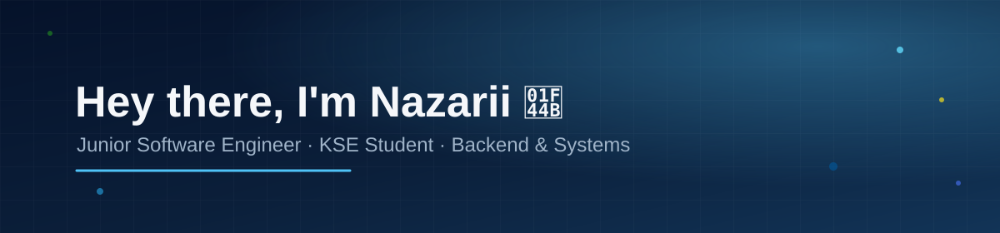

### 👨🏻‍💻 &nbsp;About Me

💡 &nbsp;I like exploring new technologies and building useful software, from backend services to systems-level code.\
🎓 &nbsp;I'm currently a student at the Kyiv School of Economics (KSE).\
🌱 &nbsp;I'm learning more about backend development, systems programming, and databases.\
💬 &nbsp;Feel free to reach out about junior roles, internships, or just to talk tech.\
✉️ &nbsp;You can email me at zarapenin2007@gmail.com — I'll try to respond as soon as I can.

### 🛠 &nbsp;Tech Stack

&nbsp;
&nbsp;
&nbsp;
&nbsp;
&nbsp;
\
&nbsp;
&nbsp;
&nbsp;
&nbsp;
\
&nbsp;
&nbsp;
&nbsp;
&nbsp;
\
&nbsp;
&nbsp;
&nbsp;

### 🚀 &nbsp;Featured Projects

**[Colorist](https://github.com/IvanIvchatov/colorist-showcase)** — e-commerce platform for a professional cosmetics brand *(real client, co-developed with a teammate)*.
Catalog with interactive shade palettes, cart and payments, customer wallet, admin panel with audit log, Docker deployment to a VPS and CI.

**[Quiz Site](https://github.com/peninnazarii/quiz_site)** — Django-based online exam/testing platform.
Timed access codes with auto-close on expiry, auto-grading, PDF certificate/protocol generation, role-based admin permissions, and PostgreSQL deployment with Gunicorn/Nginx.

### ⚙️ &nbsp;GitHub Analytics

### 🤝🏻 &nbsp;Connect with Me

